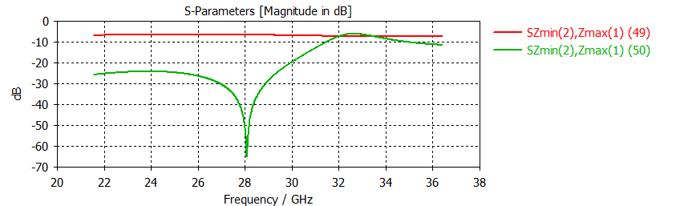
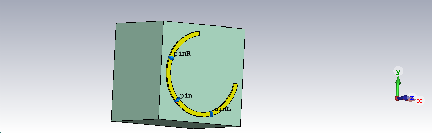
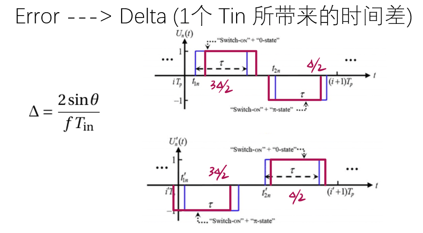

# 2021 UMJI IPP Metasurface Research

Contain all the code, report and results for 2021 IPP metasurface program. Unforgettable memories.

## Code

* c_shape_cal.m	C-shape theoretical resonance frequency
* N2bit_1D_50.m    Genetic algorithm for metasurface array element arrangement (half space)
* N2bit_1D_all.m    whole space version
* only_positive.m    ......
* pp.m    Image enhancement
* scan1D_method.m    given array element arrangement, scan the radiation pattern
* scan3D.m    3-D radiation pattern
* Time_modulated_metadurface.m    Time modulated programmable metasurface simulation

## Demo

### Structure

### Coupling

### Signal Reconstruct

### Beam forming

### TMPM

